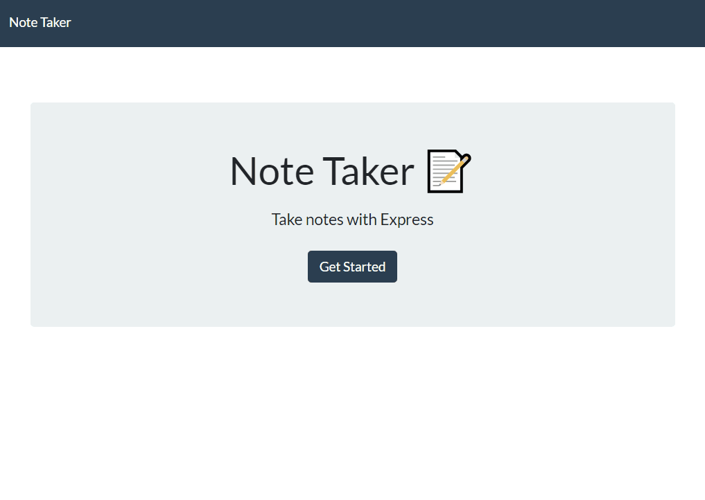

# Note Taker

 

[Deployed Heroku App](https://note-taker-mbenson.herokuapp.com/)

## Table of Contents

- [Description](#description)
- [Installation](#installation)
- [Usage](#usage)
- [Demo](#demo)
- [Technologies Used](#technologies-used)
- [Questions](#questions)
- [License](#license)

 

## Description

Application designed to write, save and delete notes dynamically. Notes are stored on a [Heroku](https://www.heroku.com/) server.

## Installation

Click on the link to the [Heroku app](https://note-taker-mbenson.herokuapp.com/) to view in browser.

## Usage

Enter notes and click the save icon to retain your details. The red grabage symbol next to each note is used to remove them.

## Demo

 

 

## Technologies Used

- [Node.js](https://nodejs.org/en/)
- [Express.js](https://expressjs.com/)
- [uuid](https://www.npmjs.com/package/uuid)

## Questions

Contact me here:

- [GitHub Profile](https://github.com/mbenson025)
- Email me at mbenson025@gmail.com

## License

MIT License

Copyright (c) 2022 Mason Benson

Licensed under the [MIT](LICENSE) license.
